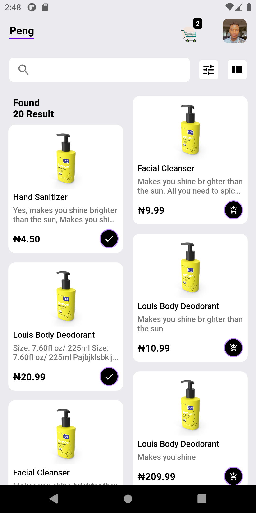
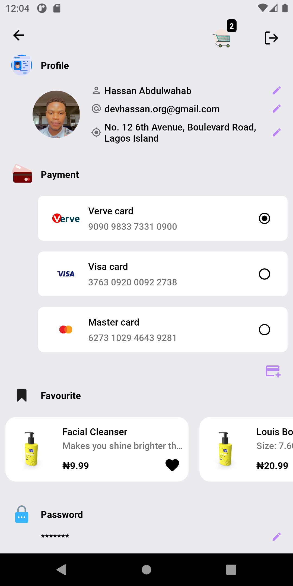
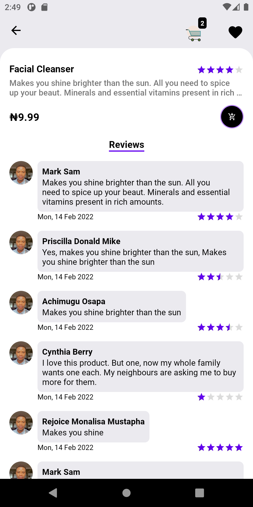
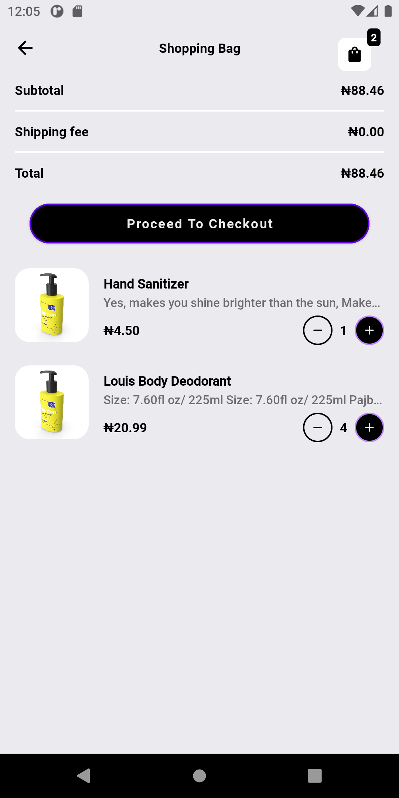

<h1 align="center">Peng</h1>

<p align="center">
  <a href="https://www.android.com/"></a>
  <a href="https://opensource.org/licenses/Apache-2.0"></a>
  <a href="https://android-arsenal.com/api?level=21"></a>
  <a href="https://github.com/abdulwahabhassan/peng/actions"></a> 
</p>

<p align="center">Peng is an e-commerce mobile application built with the latest and modern Android development tools</p>

## Preview

|            |            |            |            |
|------------|------------|------------|------------|
|  |  |  |  |

## Configurations
- Minimum SDK level 23
- Compile SDK version 32
- Current version code 1
- Current version name "1.0"

## Tech stack & Third-party libraries
- [Kotlin](https://kotlinlang.org/), [Coroutines](https://github.com/Kotlin/kotlinx.coroutines) + [Flow](https://kotlin.github.io/kotlinx.coroutines/kotlinx-coroutines-core/kotlinx.coroutines.flow/) for asynchronous operations and background processes.
- Jetpack
  - Lifecycle - Observe Android lifecycles and handle UI states upon the lifecycle changes.
  - ViewModel - Manages UI-related data holder and lifecycle aware. Allows data to survive configuration changes such as screen rotations.
  - ViewBinding - Generates binding classes for XML layout files.
  - LiveData - Lifecycle-aware observable data holder class.
  - Room - Constructs Database by providing an abstraction layer over SQLite to allow fluent database access.
  - DataStore - Data storage solution for key-value pairs or typed objects with protocol buffers.
  - Hilt - Manage dependency injection.
- Architecture
  - MVVM Architecture (Model - View - ViewModel)
  - Repository Pattern
- [Retrofit2 & OkHttp3](https://github.com/square/retrofit) - Construct the REST APIs.
- [Moshi](https://github.com/square/moshi/) - A modern JSON library for Kotlin and Java.
- [Timber](https://github.com/JakeWharton/timber) - A logger with a small, extensible API.
- [Material-Components](https://github.com/material-components/material-components-android) - Material design components for building ripple animation, and CardView.
- Custom Views / Animations
  - [Lottie Animations](https://github.com/airbnb/lottie-android) - Apply animations.
  - [MotionToast](https://github.com/Spikeysanju/MotionToast) - A simple and beautiful way to show animated toast messages.
  
## App Architecture
This app is based on the MVVM architecture and the Repository pattern.

<p align="center">
<a href="https://developer.android.com/topic/architecture/"></a> 
</p>

## License
```xml

Designed and developed by 2022 devhassan (Hassan Abdulwahab)

Licensed under the Apache License, Version 2.0 (the "License");
You may not use this file except in compliance with the License.
You may obtain a copy of the License at

   http://www.apache.org/licenses/LICENSE-2.0

Unless required by applicable law or agreed to in writing, software
distributed under the License is distributed on an "AS IS" BASIS,
WITHOUT WARRANTIES OR CONDITIONS OF ANY KIND, either express or implied.
See the License for the specific language governing permissions and
limitations under the License.

```
